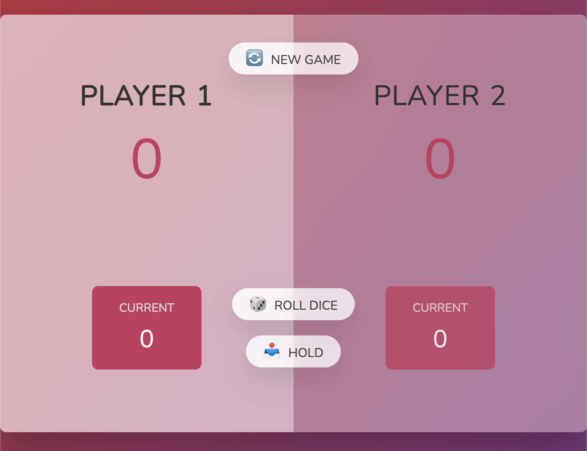

# Javascript Numbers Game
This is a simple guessing game written in vanilla Javascript. Roll the dice to add to your score. If you roll a one you lose your turn.

- Roll the dice to add to your score
- Click 'Hold' before rolling a one
- First to score 100 points wins

